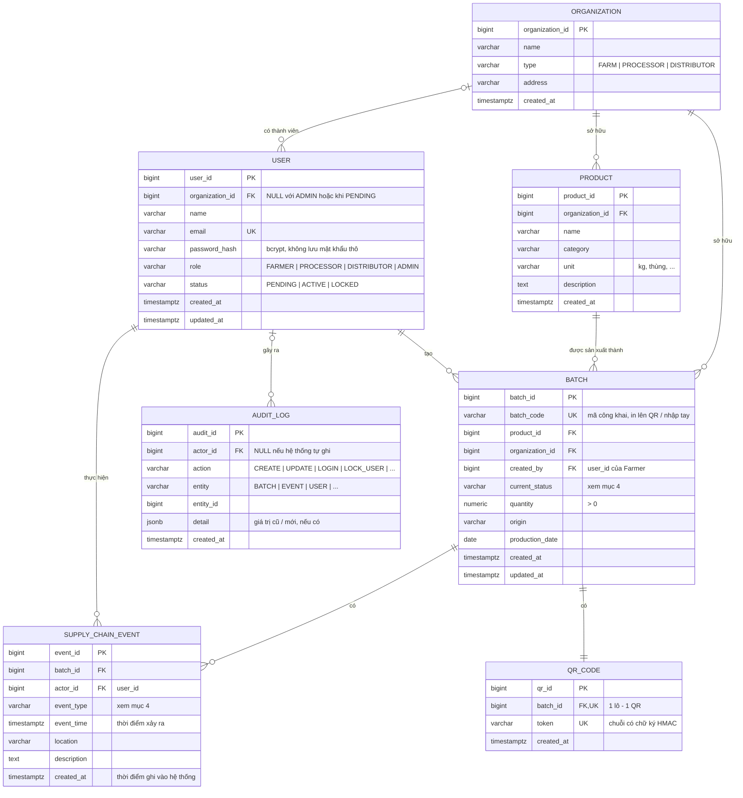

# ERD nháp v2 (W1-TV3)

**Dự án:** Food Supply Chain Traceability & Provenance Portal – Nhóm 13
**Người phụ trách:** Đặng Vĩnh Quang (TV3 - Database / Auth / Security)
**Người review:** Chung Nguyễn Minh Trí (TV2 - Backend / API)
**Trạng thái:** Bản nháp tuần 1. Mở rộng từ `docs/ERD/ERD.png` (v1), đối chiếu với `docs/openapi-spec.yaml` và `docs/api-endpoints-draft.md`.
**Hệ quản trị CSDL:** PostgreSQL 16 (theo `docker-compose.yml`).

## 1. Sơ đồ

## 2. Mô tả bảng

| Bảng | Vai trò | Khóa và ràng buộc chính |
| --- | --- | --- |
| `organization` | Đơn vị tham gia chuỗi: nông trại, cơ sở chế biến, nhà phân phối | `type` thuộc tập cho phép (CHECK) |
| `user` | Tài khoản đăng nhập. Consumer không có tài khoản | `email` unique; `password_hash` NOT NULL; `role`, `status` có CHECK; `organization_id` bắt buộc khi `ACTIVE` (trừ ADMIN). Đăng ký mới ở `PENDING`, chờ Admin duyệt (xem `permission-matrix.md`) |
| `product` | Danh mục sản phẩm của đơn vị, để nhiều lô dùng chung thông tin | FK `organization_id` |
| `batch` | Lô thực phẩm cần truy xuất | `batch_code` unique và có chỉ mục; `quantity > 0`; FK tới `product`, `organization`, `user` |
| `supply_chain_event` | Từng bước của lô trong chuỗi cung ứng | FK `batch_id`, `actor_id`; chỉ mục `(batch_id, event_time)` để lấy timeline; **chỉ INSERT** |
| `qr_code` | Mã QR gắn với lô | `batch_id` unique (1-1); `token` unique |
| `audit_log` | Nhật ký thay đổi dữ liệu và thao tác bảo mật | Chỉ mục `(entity, entity_id)` và `created_at`; **chỉ INSERT** |

Ghi chú: `user` là từ khóa trong PostgreSQL. Khi viết `schema.sql` (tuần 3) nên đặt tên bảng là `users` (số nhiều cho mọi bảng) hoặc `app_user`.

## 3. Quy tắc dữ liệu

1. **Lịch sử chỉ ghi thêm.** `supply_chain_event` và `audit_log` không có UPDATE/DELETE. Sai thì ghi thêm sự kiện điều chỉnh. Ở mức CSDL sẽ chặn bằng trigger hoặc `REVOKE UPDATE, DELETE` với user mà backend dùng (tuần 6).
2. **Không xóa lô.** Không có `DELETE /batches`. FK từ `supply_chain_event`, `qr_code` tới `batch` dùng `ON DELETE RESTRICT`.
3. **Đổi trạng thái lô phải đi kèm sự kiện.** INSERT event và UPDATE `batch.current_status` nằm trong cùng một transaction. Backend kiểm tra thứ tự hợp lệ.
4. **Tạo lô trong một transaction:** INSERT `batch` → INSERT `qr_code` → INSERT event khởi tạo → INSERT `audit_log`.
5. **Mật khẩu** chỉ lưu bcrypt hash. Không trả `password_hash` trong bất kỳ API nào.
6. **QR không đoán được.** `token` là chuỗi ngẫu nhiên hoặc có ký HMAC, không dùng `batch_id` tuần tự. Đường dẫn công khai dựng từ token (`/trace/{token}`), không lưu sẵn URL.
7. **Dữ liệu công khai** (`/trace/...`) chỉ gồm: `batch_code`, tên sản phẩm, xuất xứ, tên đơn vị, và với từng sự kiện là loại, thời điểm, địa điểm, mô tả. Không trả email, `user_id`, `actor_id` hay thông tin tài khoản.
8. **Trạng thái và loại sự kiện** tạm lưu dạng `varchar` + `CHECK` (chưa dùng `ENUM` của PostgreSQL), để đổi tên ở tuần 3 không cần migration phức tạp.

## 4. Trạng thái lô và loại sự kiện: hai phương án (chốt ở tuần 3)

| | Phương án A – theo báo cáo (State Machine) | Phương án B – theo `openapi-spec.yaml` v1.0.0 |
| --- | --- | --- |
| `batch.current_status` | CREATED → TRANSPORTED → RECEIVED → PROCESSED → PACKAGED → SHIPPED | CREATED, IN_TRANSIT, PROCESSING, PACKAGED, DISTRIBUTED, COMPLETED |
| `event_type` | Trùng tên với trạng thái đích (mỗi sự kiện đưa lô sang một trạng thái) | PRODUCTION, TRANSPORTATION, PROCESSING, PACKAGING, DISTRIBUTION |
| Ưu điểm | Có bước RECEIVED (nhận hàng), ánh xạ sự kiện ↔ trạng thái 1-1, dễ kiểm tra thứ tự | Đã có sẵn trong OpenAPI, frontend/backend đang tham chiếu |
| Nhược điểm | Phải sửa OpenAPI | Thiếu bước nhận hàng; ánh xạ event → trạng thái không 1-1, phải viết bảng chuyển trạng thái riêng |

Thiết kế bảng ở mục 1 dùng được cho cả hai phương án, chỉ khác giá trị trong `CHECK`. Nếu nhóm cần ràng buộc vai trò theo từng loại sự kiện (ví dụ chỉ DISTRIBUTOR được ghi TRANSPORTED), có thể thêm bảng tra cứu `event_type (code PK, name, allowed_role, to_status)` ở tuần 6.

## 5. Trả lời các điểm mở trong `docs/api-endpoints-draft.md`

- **Câu 4 – Mã lô duy nhất:** Giữ cả hai. `batch_id` (số tự tăng) là khóa nội bộ dùng trong API đã đăng nhập. `batch_code` (unique, ví dụ `BATCH-2026-000123`) là mã công khai cho QR và nhập tay. Đề xuất thêm `batch_code` vào schema `Batch` trong OpenAPI.
- **Câu 5 – Organization:** Có. Cần cho quản lý đơn vị (FR-07), cho việc xác định Distributor/Processor xem lô trong phạm vi nào, và để trang công khai hiện tên đơn vị thay vì tên người. Cần bổ sung vào Class Diagram ở tuần 3.
- **Câu 6, 7** (đăng ký chọn vai trò; endpoint đọc nào cần đăng nhập): trả lời trong `docs/permission-matrix.md`.

Ngoài ra, so với OpenAPI hiện tại:
- `Batch` trong OpenAPI dùng `product_name`. ERD tách sang bảng `product`; API vẫn có thể trả `product_name` bằng JOIN.
- `QRCode.qr_data` trong OpenAPI tương ứng `token` ở đây (xem quy tắc 6).
- `SupplyChainEvent.timestamp` trong OpenAPI tương ứng `event_time`. Đổi tên vì `timestamp` là tên kiểu dữ liệu trong SQL.

## 6. Thay đổi so với ERD v1 (`ERD.png`)

| Thay đổi | Lý do |
| --- | --- |
| Thêm `organization`, `product`, `audit_log` | Kế hoạch tuần 4–6 và FR-07, FR-08, FR-09 |
| `user.password` → `password_hash`; thêm `status`, `organization_id` | Bảo mật (bcrypt); duyệt và khóa tài khoản; phạm vi theo đơn vị |
| `batch` thêm `batch_code` (unique), `product_id`, `organization_id`; bỏ `product_name` | Mốc tuần 5 yêu cầu mã lô không trùng; chuẩn hóa dữ liệu |
| `creation_date` → `production_date` + `created_at` | Tách ngày sản xuất thực tế với thời điểm ghi vào hệ thống |
| `supply_chain_event.timestamp` → `event_time` + `created_at` | Như trên; tránh trùng tên kiểu SQL |
| `qr_code.qr_data` → `token` (unique) | QR không đoán được, hỗ trợ HMAC |
